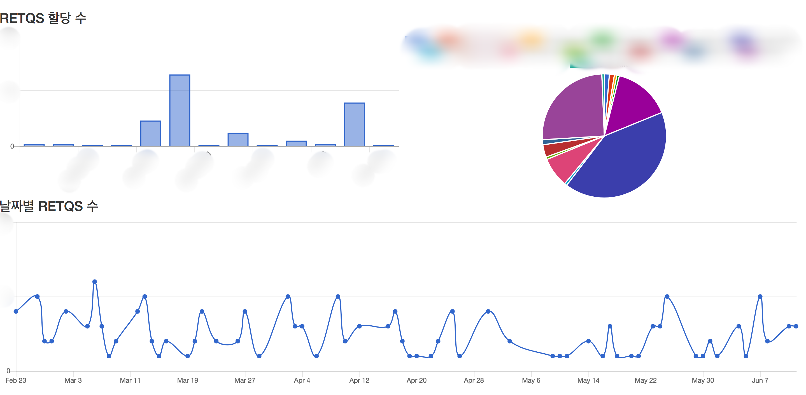
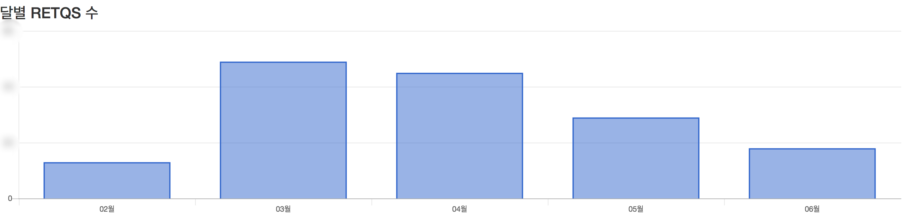
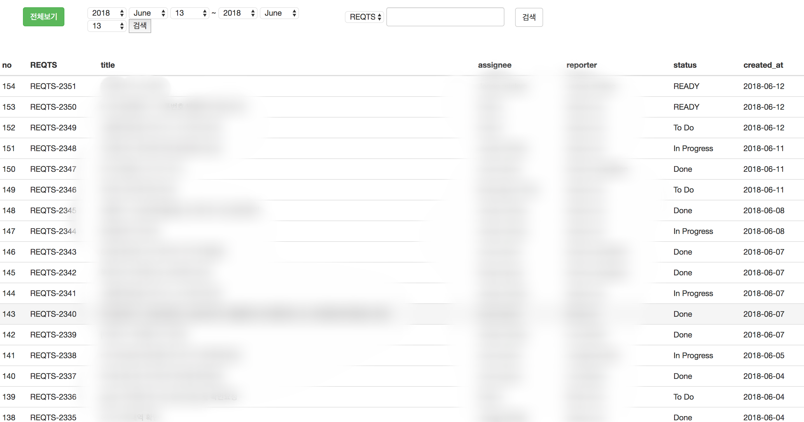

# Ruby Crawling

##### 목적

crawling으로 유명한 python에 beautifulsoup이 있지만, ruby on rail가 익숙하므로 ruby on rail에서 crawling을 하기 위해 nokogiri gem을 이용해 crawling을 연습.

##### nokogiri gem

공식 사이트 : http://www.nokogiri.org/ https://github.com/sparklemotion/nokogiri

크롤링을 하기 위해서 많이 사용되는 gem.

설치

~~~
gem install nokogiri
~~~

사용법

~~~ruby
require 'nokogiri'
require 'open-uri'

# Fetch and parse HTML document
doc = Nokogiri::HTML(open('http://www.nokogiri.org/tutorials/installing_nokogiri.html'))

puts "### Search for nodes by css"
doc.css('nav ul.menu li a', 'article h2').each do |link|
  puts link.content
end

~~~

##### mechanize gem

공식 사이트 : https://github.com/sparklemotion/mechanize

웹을 컨트롤하기 위해서 사용되는 gem. 기본적으로 watir과는 다르게 브라우저가 불필요. 로컬에서 할 때는 watir이 문제가 없었으나, 배포를 위해 서버에 설치를 하였을 경우, 이슈가 생겨서 watir를 대신 mechanize를 사용.

설치

~~~
gem install mechanize 
~~~

사용법

~~~ruby
require 'mechanize'
 
mechanize = Mechanize.new
 
page = mechanize.get('http://naver.com/')
 
puts page.title
~~~

##### Configuration

ruby 2.2.4

rails 5.0.7

aws - ec2

server - ubuntu 16.04, apache2, passenger

mysql

##### Service

crawling한 값들을 브라우저를 띄울때 마다 읽어오면 페이지 로딩 시간이 느려져서 크롤링 한 값들을 DB에 넣은 후, DB에 있는 값들을 페이지에 표시.

crawling한 값들을 DB에 저장은 rak job으로 생성하여, crontab을 이용해서 매 시간 마다 rake job을 수행.

Crawling 한 값들을 읽어와서 기존의 DB값과 비교한 후, DB의 값이랑 다른 경우, update를 수행, 새로운 값이 들어오면 DB에 insert를 함.

crawling한 값들을 통계를 내기 위해서, chartkick gem을 사용.

